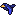
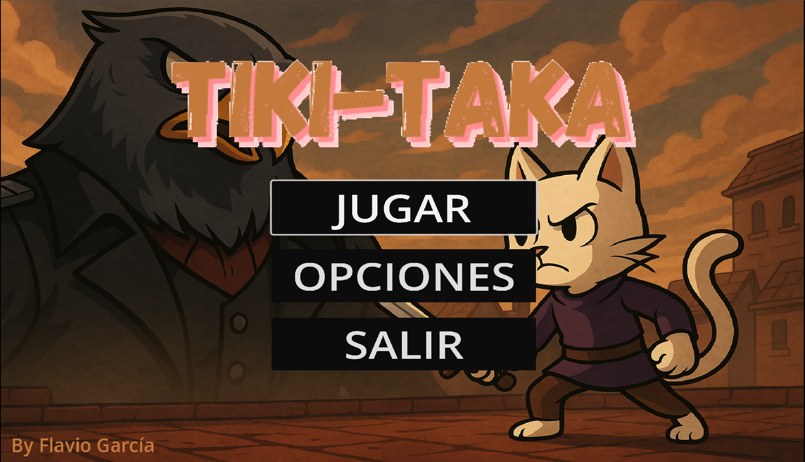
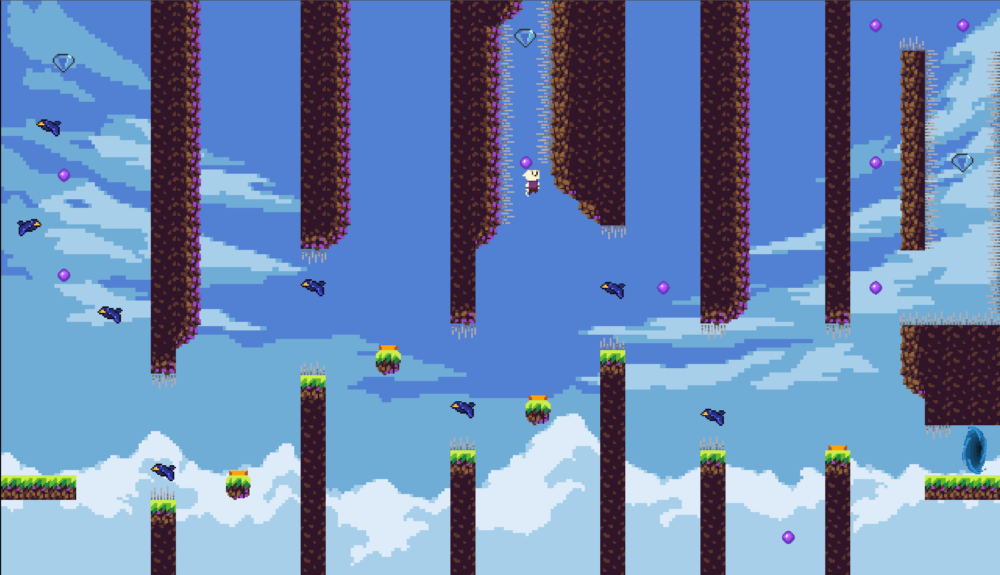
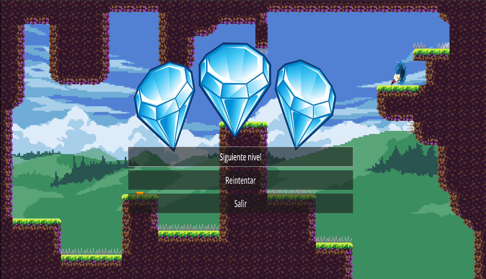

# Tiki-Taka

>Videojuego de plataformas 2D desarrollado con Godot Engine 4.3

## :game_die: Introducción
Tiki-taka es un videojuego 2D de plataformas con una estética pixelart desarrollado en Godot. 

En esta aventura encarnarás a **Tiki**, un gato ágil y valiente que se adentra en el territorio del temido **General Taka**, un halcón que reina desde las alturas, y cuyo ejército de aves custodia cada rincón de su dominio.

Tu objetivo será guiar a Tiki a través de todos los niveles, enfrentándote a los desafíos que el General y sus tropas han preparado, y recogiendo los **diamantes** que el halcón robó a su pueblo.


---

## :gear: Tecnologías utilizadas
Este proyecto ha sido desarrollado empleando las siguientes tecnologías:
* Motor de juego: [Godot Engine 4](https://godotengine.org/)
* Lenguaje de programación: [GDScript](https://docs.godotengine.org/en/stable/)
* Gráficos: [Aseprite](https://www.aseprite.org/)
* Imágenes: [Gimp](https://www.gimp.org/)

---

## :computer: Instalación
A continuación, se explican los pasos necesarios para poder ejecutar el videojuego en tu dispositivo Windows:
#### 1. Clonar o descargar el repositorio
Puedes clonar el repositorio utilizando Git o descargar directamente el archivo zip desde GitHub.
- Clonar el repositorio:
```
git clone https://github.com/Flagn3/Tiki-Taka.git
```
- Descargar el zip: [Clic para descargar](https://github.com/Flagn3/Tiki-Taka/archive/refs/heads/main.zip)

#### 2. Ejecutar el archivo .exe
- Dirígete a la carpeta del proyecto descargado.
- En el interior de la carpeta encontrarás un archivo ejecutable *Tiki-Taka.exe*
- Haz doble clic sobre el archivo .exe para ejecutar el juego.

---

## :video_game: Controles

> Se recomienda el uso de un mando para mayor comodidad y precisión en los controles

|Teclado|Mando                                |Acción                       |
|:-----:|:-----------------------------------:|:---------------------------:|
|A      | Joystick ←                          |Moverse hacia la izquierda   |
|D      | Joystick →                          |Moverse hacia la derecha     |
|Espacio|             |Saltar               |
|M      |   |Dash                 |
|P      | Start                                         |Pausa                |
|Espacio|             |Confirmar (Menús)    |
|Esc    |     | Atrás (Menús)       |
| R     |   | Eliminar archivo de guardado|

---

## :space_invader: Elementos del juego  

A lo largo de los niveles del juego, encontrarás los siguientes elementos que ayudarán a Tiki o lo pondrán a prueba:

- **Diamantes**
 
Coleccionables que han sido robados del pueblo del protagonista. Se pueden recoger hasta 3 por nivel.

- **Trampolines**
 
Lanzan a Tiki por los aires y le devuelven la capacidad de utilizar el dash al instante.

- **Orbes mágicos**

Al tocarlos, Tiki recuperará la capacidad de utilizar el dash. Reaparecen al cabo de unos segundos.

- **Pinchos**
 
Obstáculos letales que reinician el nivel si Tiki los toca.

- **Pájaros**

Secuaces del General Taka que patrullan los niveles. Si tocan a Tiki se reiniciará el nivel.

- **Portal**

Al llegar a él, Tiki superará el nivel en el que se encuentra, con el número de diamantes que haya recogido.

---

## :framed_picture: Imágenes del juego







---

## :scroll: Licencia

Este proyecto se encuentra bajo la licencia MIT (mirar el archivo [LICENSE](LICENSE) para más detalles).

---
